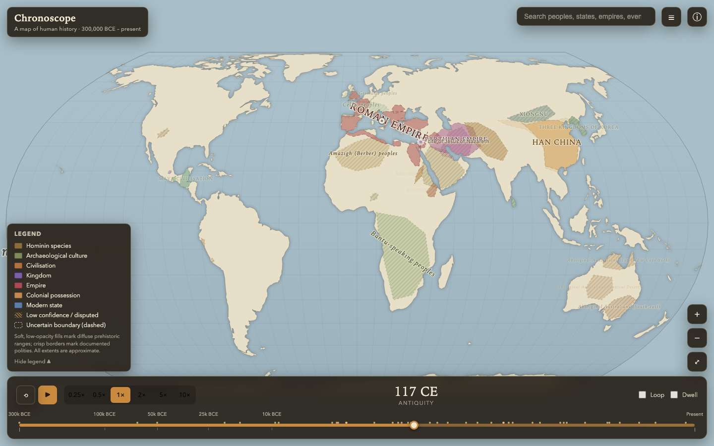

# Chronoscope — A Map of Human History

An interactive, zoomable world map of the geographical history of humanity, from
the emergence of *Homo sapiens* (~300,000 BCE) to the present day. Drag or play a
non‑linear timeline and watch hominin ranges, archaeological cultures, early
civilisations, empires, colonial possessions and modern states fade in, shift and
fade out over a polished, atlas‑styled basemap.

> **Chronoscope is an interpretive teaching tool, not an authoritative atlas.**
> Every boundary shown is an approximate historical interpretation. See
> [`docs/METHODOLOGY.md`](docs/METHODOLOGY.md) and the in‑app **ⓘ Methodology**
> page.



---

## Quick start

Requires **Node 18+** (developed on Node 26) and npm.

```bash
npm install
npm run dev            # http://localhost:5178
```

Other commands:

```bash
npm run build          # type-check + production build to dist/
npm run preview        # serve the production build
npm run test           # vitest unit tests (history engine, dates, playback, data)
npm run test:e2e       # Playwright end-to-end tests (needs: npx playwright install chromium)
npm run screenshots    # regenerate docs screenshots into screenshots/
npm run typecheck      # tsc, no emit
```

---

## What you can do

- **Move continuously from ~300,000 BCE to the present** on a non‑linear slider that
  gives deep prehistory broad strokes and recent centuries fine detail.
- **Play, pause, loop and restart** playback at 0.25× – 10×, with an optional
  “dwell” mode that pauses briefly at the most important events.
- **Pan and zoom** the map (mouse drag / wheel, pinch on trackpads, on‑screen
  ± / reset controls, or double‑click). Labels and borders sharpen as you zoom in.
- **Click any territory or event** for an information panel with dates, confidence,
  predecessors/successors, related events and full source citations.
- **Search** peoples, states, empires, cultures and events; selecting a result flies
  the camera and timeline to it.
- **Read an accessible text list** (☰) of everything currently visible, and operate
  every control by keyboard.

### Keyboard controls

| Key | Action |
| --- | --- |
| `Space` | Play / pause |
| `←` / `→` | Step back / forward (hold `Shift` for larger steps) |
| `Home` / `End` | Jump to start / present (when the slider handle is focused) |
| `+` / `−` | Increase / decrease playback speed |
| `R` | Restart to 300,000 BCE |
| `L` | Toggle looping |
| `?` | Open the methodology page |
| `Esc` | Close the open panel |
| `Ctrl`+`P` | Toggle the developer performance overlay |

---

## Architecture in one paragraph

The **historical engine** (`src/history`, `src/animation`) is a pure, framework‑
and renderer‑agnostic core: a BCE‑capable date model, an invertible non‑linear
timescale, and functions that decide which entities/events are active at a date and
how faded they are. The **map renderer** (`src/map`) is a self‑contained HTML5
Canvas 2D renderer using a d3‑geo Equal Earth projection; it consumes the engine’s
output and owns pan/zoom and hit‑testing. **React** (`src/components`) is only the
UI shell — panels, timeline, search, legend. Playback drives a tiny external store,
so animating the map at 60 fps never re‑renders the React tree. See
[`docs/ARCHITECTURE.md`](docs/ARCHITECTURE.md).

```
src/
  animation/   playback engine + time store (slider-space playback, external store)
  components/   React UI: Timeline, MapView, InfoPanel, EventPanel, Search, Legend…
  data/         the historical dataset (entities, events) + authoring helpers
  history/      date model, non-linear timescale, activation/interpolation engine
  map/          Canvas renderer, Equal Earth view/projection, labels, basemap, palette
  types/        shared TypeScript interfaces (the data contract)
  styles/       global CSS (one polished parchment/dark theme)
```

---

## Adding data — no renderer changes required

The dataset lives entirely in `src/data`. The core entities are in
`src/data/entities.ts`; the bulk of the detail is grouped by region/theme in
`src/data/regions/*.ts` (Britain, antiquity, the Near East, Europe, East/South/
Southeast Asia, the Islamic world, Africa, the Americas, Oceania, broad peoples,
colonial empires, prehistory, and modern states), and `src/data/index.ts` simply
spreads them all into one `ENTITIES` array — so adding a whole new region is one
import and one spread. You can add a single entity or event
by editing any of those files or `src/data/events.ts`; **nothing in `src/map` needs
to change.** Authoring helpers (`src/data/helpers.ts`) keep it terse and safe
(polygon winding is normalised for you). See
[`docs/DATA_SCHEMA.md`](docs/DATA_SCHEMA.md) for the full schema. The data‑integrity
test enforces unique ids, resolvable predecessor/successor links, sane geometry and
required sources across every module.

A minimal new entity:

```ts
import { bce, ce, poly, snap, src } from './helpers';

{
  id: 'my-kingdom',
  name: 'My Kingdom',
  category: 'kingdom',
  start: bce(500),
  end: ce(200),
  confidence: 'medium',
  sources: [src('Author 2020, Some Book')],
  snapshots: [
    snap(bce(400).year, poly([[10, 40], [20, 40], [20, 50], [10, 50]]), 'medium',
      'Approximate extent at its height.'),
  ],
}
```

Modern states can reference a Natural Earth country by name instead of drawing a
polygon, so their coastline matches the basemap exactly:

```ts
snap(ce(2026).year, { naturalEarthCountry: 'France' }, 'high')
```

The data‑integrity test (`src/data/data.test.ts`) will validate new entries:
sources present, snapshots ordered, geometry winding sane, relations resolvable.

---

## Technology choices (and why)

| Concern | Choice | Why |
| --- | --- | --- |
| Framework | React + TypeScript + Vite | Requested, maintainable, fast HMR. |
| Rendering | **HTML5 Canvas 2D** + d3‑geo | See note below — chosen over WebGL map libs for projection freedom, crossfade control and simplicity at this data scale. |
| Projection | **Equal Earth** (`d3-geo`) | Equal‑area (fair across 300 millennia of shifting focus), low distortion, not tied to web‑Mercator tiles. |
| Geodata | Natural Earth via `world-atlas` (TopoJSON) | Public domain; 110m default, 50m lazy‑loaded for close zoom. |
| Spatial maths | `d3-geo` (`geoContains`, `geoArea`, `geoCentroid`, `geoPath`) | Spherical, correct for hit‑testing and label placement; avoids a heavier Turf dependency. |
| Tests | Vitest + Playwright | Requested; fast unit core + real‑browser E2E. |

**Why Canvas rather than MapLibre/deck.gl?** The brief asked us to choose based on
animation quality, projection support, performance and licence. MapLibre centres on
web‑Mercator vector tiles and would fight an Equal Earth, deep‑time use case;
deck.gl is excellent but heavyweight for a hand‑authored dataset of this size.
A direct Canvas renderer gives complete control over crossfading incompatible
historical geometries, atlas‑style curved labels, hatched uncertainty fills, and
coastline‑clipped territory fills — while staying easy to read and extend. The
renderer is deliberately isolated behind the engine’s data types so it can be
swapped for a WebGL implementation later without touching the history model.

---

## Data sources, licences & attribution

| Data | Source | Licence |
| --- | --- | --- |
| Coastlines, land, modern country polygons | [Natural Earth](https://www.naturalearthdata.com/) via [`world-atlas`](https://github.com/topojson/world-atlas) | **Public domain** |
| Historical territories & events | Hand‑authored in `src/data`, based on the scholarship cited **in each entity/event panel** | Original content in this repo; released under the repo licence |

Every historical entity and event carries explicit `sources` with citations (and
URLs where available), surfaced in the information panels and enumerable in the
data. No dataset with an incompatible licence is bundled. The historical
geometries are original, coarse interpretations drawn for this project — they are
**not** copied from any proprietary atlas or game.

Chronoscope takes general stylistic inspiration from historical atlases and
grand‑strategy maps but contains **no** third‑party artwork, textures, icons, fonts
or other protected assets; the look is produced entirely in code with system fonts.

---

## Known limitations

See [`docs/LIMITATIONS.md`](docs/LIMITATIONS.md) for the full list. In brief: the
dataset is a *representative demonstration* (~288 entities, 52 events), historical
polygons are coarse approximations, snapshot transitions use crossfade rather than
true vertex morphing, and label placement is good but not typeset‑atlas perfect.

## Assumptions recorded

- “Present day” is fixed at mid‑2026 (the app’s build date context).
- The slider’s left edge is 300,000 BCE (Jebel Irhoud *H. sapiens*); the curve
  constant `C = 55` was tuned so recent centuries are comfortably explorable.
- Dates use the astronomical convention internally (year 0 = 1 BCE) but **never
  display a year zero**.
- Prehistoric “ranges” are envelopes of inferred presence, not territories, and are
  rendered as such (soft, hatched, low‑confidence).
